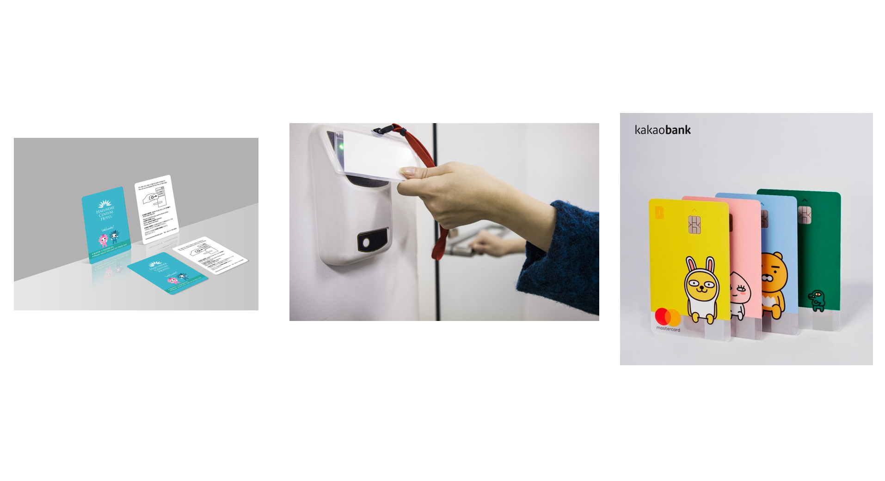
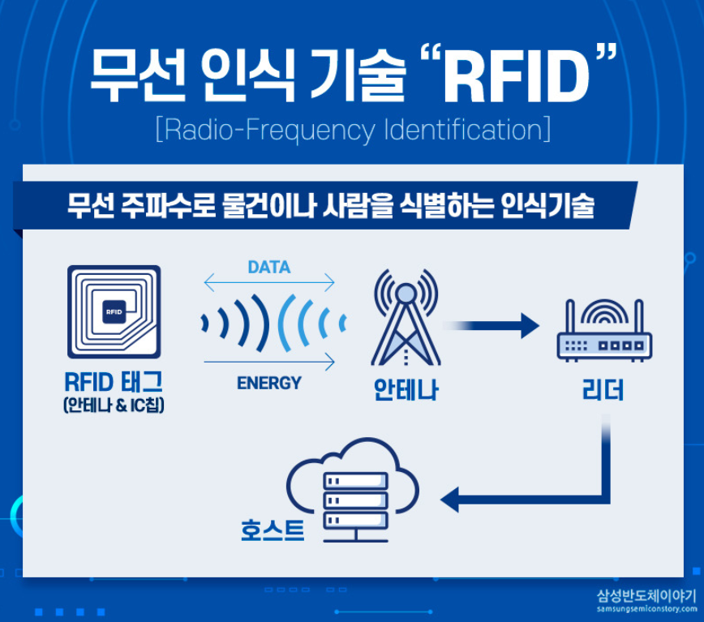
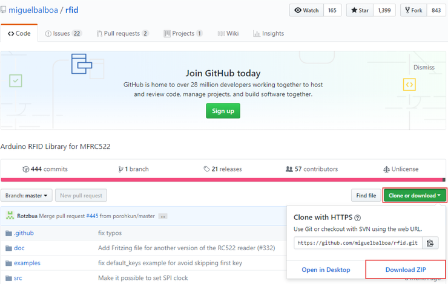
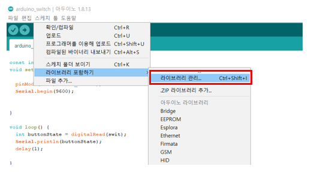
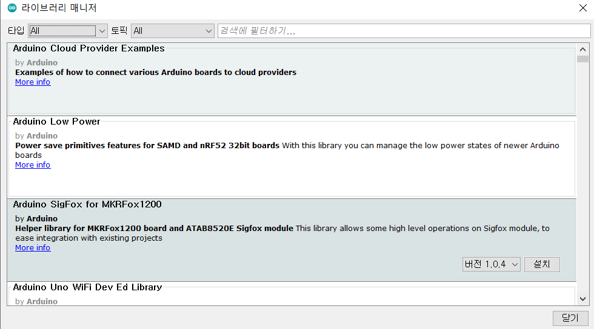
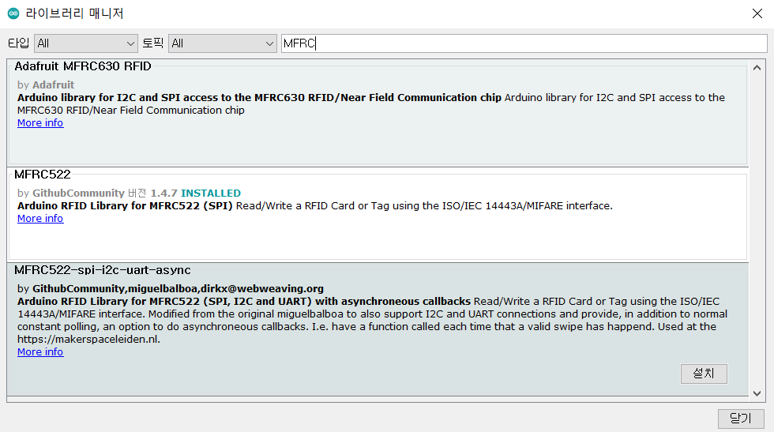
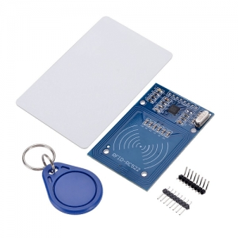
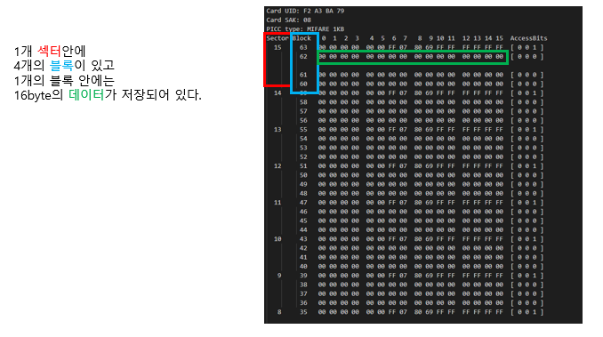
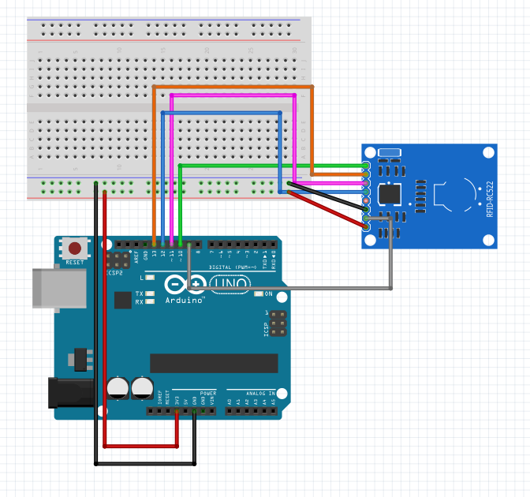

# [한타중] 야 거기서 파란카드를 뽑으면....(RFID 카드)
  
  

이번 프로젝트에 가장 중요한 RFID에 대해 설명하겠다. RFID는 Radio-Frequency Identification의 약자로 무선 주파수를 식별한다는 뜻이다. RFID는 태그와 리더기가 필요하다. 만약 ID를 가지고있는 테그를 리더기에 가깝게 가져가면 사물의 ID 데이터를 읽어 올 수 있다. 이러한 RFID는 사용하는 동력으로 분류 되는데 핀독기 동력만으로 칩의 정보를 읽고 통신하는 RFID를 수동형(Passive) RFID라 한다. 그리고 반수동형(Semi-passive) RFID란 태그에 건전지가 내장되어 있어 칩의 정보를 읽는 데는 그 동력을 사용하고, 통신에는 판독기의 동력을 사용하는 것을 말한다. 마지막으로 능동형(Active) RFID는 칩의 정보를 읽고 그 정보를 통신하는 데 모두 태그의 동력을 사용한다.  
　  
이러한 RFID는 실생활에서 많이 쓰인다. 일반 버스의 교통 카드, 회사의 출입카드, 호텔 키 카드, 도서관의 도서관리 등 열쇠 고리나 카드에 부착되어 RFID 태그와 RFID 리더 간 데이터를 교환한다.   
  
　  
　  
그렇다면 이렇게 많은 곳에 사용되고 있는 RFID의 원리는 무엇일까? 먼저 RFID를 구성하는 것에 태크 리더가 있다고 하였다. 태그에는 ID정보가 들어 있는데 아무 전원을 공급하지 않으면 작동을 안하게 된다. 리더는 자기장을 발생한다. 이때 태그를 리더에 가져가면 태그의 코일에서 전류가 발생하고 이를 통해 내장된 칩에 전원이 공급된다. 이때 태그의 정보가 리더의 안테나로 전송되면서 리더는 대상을 식별하게 된다.  
　  
　  

  
　  
이때 NFC와 다른점이 무엇인가 하고 질문을 한다면 많은 것이 남을 것이다. 이를 궁금한 사람들은 밑의 링크를 참조 하길 바란다.   

 [NFC VS RFID](https://www.samsungsemiconstory.com/2269)

이제 실험에 들어갈 것인데 그전에 라이브러리 설치를 해보자 라이브러리를 설치하는 방법은 두가지가 있다. 첫번째는 직접 library를 github에 들어가서 다운 받는 것이다.   
[](https://github.com/miguelbalboa/rfid)  
　  
두번째 방법으로는 arduino IDE안에서 라이브러리를 다운 받는 것이다.  
아두이노 안에 라이브러리 매니저가 있는데 Arduino에서 오픈소스로 제공하는 것이 많으므로 대부분의 라이브러리는 여기서 다운 받을 수 있다.  
  
스케치-라이브러리 포함하기 - 라이브러리 관리를 클릭해라

그렇다면 이러한 창이 나올 것이다 이때 검색 창에 원하는 라이브럴릴 검색해라

그리고 저렇게 라이브러리가 나오면 설치버튼을 누르면 이제 그 라이브러리를 사용할 수 있게 된다.  
이제 실험 할 준비를 다시 해보자  
  
이번에 [RC522모듈](https://www.nxp.com/docs/en/data-sheet/MFRC522.pdf)을 사용 할 것이다. 이것을 통해 여러가지 실험을 해 볼 것이다.  
실험 1에서 태그에 ID데이터를 쓸 수 있는데 여기서
   
이렇게 데이터가 나오게 되는데 RFID의 데이터를 쓰고 뜯을 수 있는데 이것을 우리가 원하는 값으로 바꾸는데 까지 해서 실험2에 진행 할 것이다.

***
1. RFID 태그 ID 데이터 읽기  
2. RFID 태그에 데이터 쓰기  
　  
준비물  
***  
아두이노 우노, 브레드 보드, 점퍼선, RC522 모듈
  
　  
소스 코드
***
실험 1. RFID 태그 ID 데이터 읽기  
```

#include <SPI.h>

#include <MFRC522.h>


constexpr uint8_t RST_PIN = 9;          //구성가능, 일반 핀 참조

constexpr uint8_t SS_PIN = 10;           //구성가능, 일반 핀 참조


MFRC522 mfrc522(SS_PIN, RST_PIN);               //MFRC522 인스턴스 생성


void setup() {

 Serial.begin(9600);           //시리얼 통신 시작

 while (!Serial);            //직렬 포트가 열려있지 않은 경우 (ATMEGA32U4 기반 Arduino 추가

 SPI.begin();               //SPI 버스 시작

 mfrc522.PCD_Init();            //MFRC522 시작

 mfrc522.PCD_DumpVersionToSerial();              //PCD의 세부정보 표시 - MFRC522 카드 세부정보 표시

 Serial.println(F("Scan PICC to see UID, SAK, type, and data blocks..."));

}


void loop() {

 if ( ! mfrc522.PICC_IsNewCardPresent()) {   
     printf("Error 1");          //새 카드 찾기

  return;

 }   


 if ( ! mfrc522.PICC_ReadCardSerial()) {              //카드 중 하나 선택
 printf("Error 1");

  return;

 }


 mfrc522.PICC_DumpToSerial(&(mfrc522.uid));            //카드에 대한 디버그 정보 덤프, PICC_HaltA()가 자동으로 호출 됨
}
```  

실험 2. RFID 태그에 데이터 쓰기